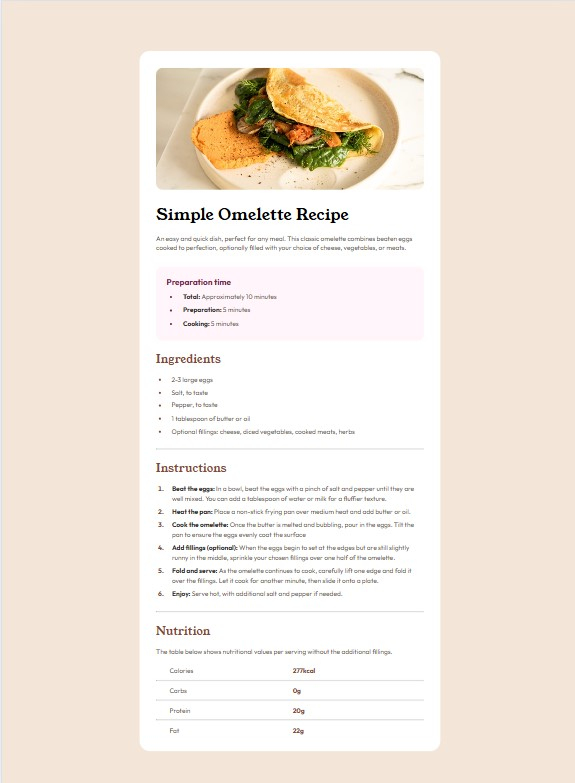
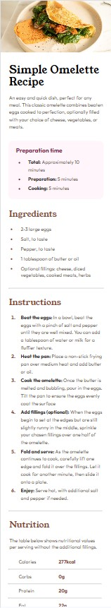

# Frontend Mentor - Recipe page solution

This is a solution to the [Recipe page challenge on Frontend Mentor](https://www.frontendmentor.io/challenges/recipe-page-KiTsR8QQKm). Frontend Mentor challenges help you improve your coding skills by building realistic projects. 

## Table of contents

- [Overview](#overview)
  - [The challenge](#the-challenge)
  - [Screenshot](#screenshot)
  - [Links](#links)
- [My process](#my-process)
  - [Built with](#built-with)
  - [What I learned](#what-i-learned)
  - [Useful resources](#useful-resources)
- [Author](#author)

## Overview

### Screenshot

### Links

- Solution URL: [Add solution URL here](https://github.com/AnthonyCampana/recipe-page-main)
- Live Site URL: [Add live site URL here](https://anthonycampana.github.io/recipe-page-main/)

## My process

### Built with

- Semantic HTML5 markup
- CSS custom properties
- Flexbox

### What I learned

I learned how to position objects together so they have equal amount of spacing as the design given.

### Useful resources

- [Developer Mozilla](https://developer.mozilla.org/en-US/) - This resource helped me identify  what properties and semantics i need to replicate the design on a web page.

## Author

- Website - [Anthony Campana](http://anthonycampana.pythonanywhere.com)
- Frontend Mentor - [@AnthonyCampana](https://www.frontendmentor.io/profile/AnthonyCampana)

